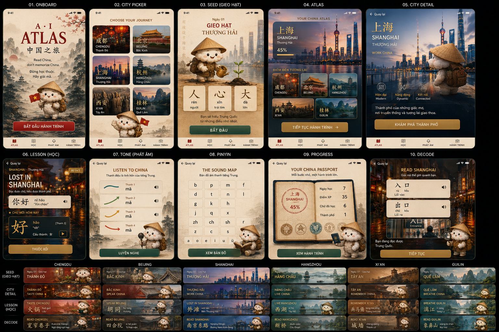

# AI Atlas · Atlas Trung Hoa

> Read China, don't memorize China.

AI Atlas là prototype app học tiếng Trung cho người Việt theo hướng du hành qua các thành phố Trung Quốc. Thay vì bắt người học ghi nhớ rời rạc, app giúp họ giải mã chữ Hán từ nét, bộ thủ, chữ, từ và ngữ cảnh đời thực.



## Ý tưởng chính

Người học không đi theo bài học tuyến tính khô cứng. Họ bắt đầu bằng một thành phố như Thượng Hải, Thành Đô, Bắc Kinh, Hàng Châu, Tây An hoặc Quế Lâm, sau đó mở khóa từng "hạt giống" chữ Hán để đọc được nhiều hơn qua mỗi ngày.

Lời hứa cốt lõi của AI Atlas:

**Bạn đọc được 100% nội dung app hiện ra**, vì hệ thống chỉ sinh nội dung từ những chữ người học đã biết, cộng thêm đúng một chữ mới.

## Điểm khác biệt

- **Học bằng giải mã:** chữ Hán được tách thành bộ phận có nghĩa, ví dụ `木 + 木 = 林`.
- **Nội dung i+1:** mỗi bài chỉ thêm một phần mới, giúp người học không bị ngợp.
- **City-based journey:** mỗi thành phố là một chủ đề, một visual identity và một bộ chữ riêng.
- **Mascot MÂY:** hướng dẫn viên mây bông đội nón lá, tạo cảm giác gần gũi cho người Việt.
- **Editorial luxury UI:** giao diện lấy cảm hứng từ atlas du lịch, postcard, con dấu passport và ảnh thành phố.

## Các màn hình chính

| Màn hình | Vai trò |
|---|---|
| Onboard | Giới thiệu thương hiệu AI Atlas và lời hứa "đừng học thuộc, hãy giải mã" |
| City Picker | Chọn thành phố bắt đầu hành trình |
| Seed | Gieo những chữ nền tảng đầu tiên |
| Atlas | Xem tiến độ tổng quan và các điểm đến tiếp theo |
| City Detail | Khám phá thành phố hiện tại, chủ đề và CTA học tiếp |
| Lesson | Học câu i+1 với chữ mới trong ngữ cảnh |
| Tone | Luyện nghe và phát âm 4 thanh điệu |
| Pinyin | Bản đồ âm đầu, âm cuối và cách đọc |
| Progress | Passport học tập, XP, streak và số chữ đã mở khóa |
| Decode | Đọc hiểu chữ/từ quanh thành phố bằng các chữ đã biết |

## Thành phố và chủ đề

| Thành phố | Chủ đề | Seed chữ tiêu biểu |
|---|---|---|
| Chengdu · Thành Đô | Ẩm thực | 火, 锅, 辣, 茶, 吃, 喝 |
| Shanghai · Thượng Hải | Công việc, đời sống hiện đại | 我, 你, 好, 人, 大, 心 |
| Beijing · Bắc Kinh | Giao tiếp | 你, 好, 我, 吃, 喝, 口 |
| Hangzhou · Hàng Châu | Lối sống | 水, 月, 山, 木, 女, 茶 |
| Xi'an · Tây An | Lịch sử, ghi nhớ | 日, 月, 大, 人, 口, 火 |
| Guilin · Quế Lâm | Thiên nhiên | 山, 水, 木, 日, 月, 火 |

## Cách chạy prototype

Không cần cài dependency hoặc build step.

1. Clone repository.
2. Mở file `chinese-tutor-agent/ai-atlas-standalone.html` bằng trình duyệt (bản tự chạy offline, mascot nhúng sẵn).
3. Chọn thành phố, đi qua màn Gieo hạt và bắt đầu học.

```bash
open chinese-tutor-agent/ai-atlas-standalone.html
```

Phiên bản đầy đủ (`chinese-tutor-agent/ai-atlas.html`) chạy trên server và đã được **deploy trên GreenNode AgentBase**, với API sinh bài học i+1 động (`/lesson` qua LLM, có fallback offline). Ngoài AI Atlas, repo còn có **Thầy Trung** — gia sư chat (route `/chat`) với 8 tool: phiên âm, nét, 100 bộ thủ, thơ ca, từ vựng HSK, ngữ pháp HSK 1-4.

## Cấu trúc repo

```text
.
├── README.md
├── assets/
│   ├── ai-atlas-showcase.png      # ảnh 10 màn hình
│   └── may-mascot.png             # mascot MÂY
└── chinese-tutor-agent/
    ├── ai-atlas.html              # app đầy đủ (server build, đang deploy)
    ├── ai-atlas-standalone.html   # bản chạy offline (double-click)
    ├── ai-atlas-ui-reference.html # 10 màn tĩnh để tham chiếu UI
    ├── main.py                    # AgentBase runtime: routes + Thầy Trung + /lesson
    ├── chat.html                  # giao diện Thầy Trung
    ├── poetry.py · vocab.py · grammar.py · radicals.py · pinyin_data.py
    ├── data/                      # thơ, HSK vocab/grammar, 100 bộ thủ, mascot
    ├── Dockerfile · requirements.txt
    └── ...
```

## Demo flow gợi ý

1. Mở app ở màn Onboard.
2. Chọn Shanghai để vào hành trình đầu tiên.
3. Đi qua Seed: học `人`, `心`, `大`.
4. Vào Atlas để thấy thành phố hiện tại và các điểm đến tương lai.
5. Mở Lesson để xem app sinh bài học theo nguyên tắc i+1.
6. Chuyển qua Tone hoặc Pinyin để demo phát âm.
7. Kết thúc ở Progress như một "China Passport" của người học.

## Trạng thái hiện tại

Đây là prototype phục vụ hackathon, tập trung vào:

- trải nghiệm người dùng trên mobile;
- visual direction rõ ràng;
- logic học theo đồ thị thành phần;
- khả năng demo nhanh mà không cần backend.

Các hướng phát triển tiếp theo:

- kết nối backend lưu tiến độ người học;
- thêm OCR/camera để đọc biển hiệu thật;
- tích hợp LLM để sinh nội dung i+1 động;
- thêm audio chuẩn cho pinyin và thanh điệu;
- đóng gói thành PWA hoặc React Native app.

## Tagline

**Đừng học thuộc. Hãy giải mã.**

